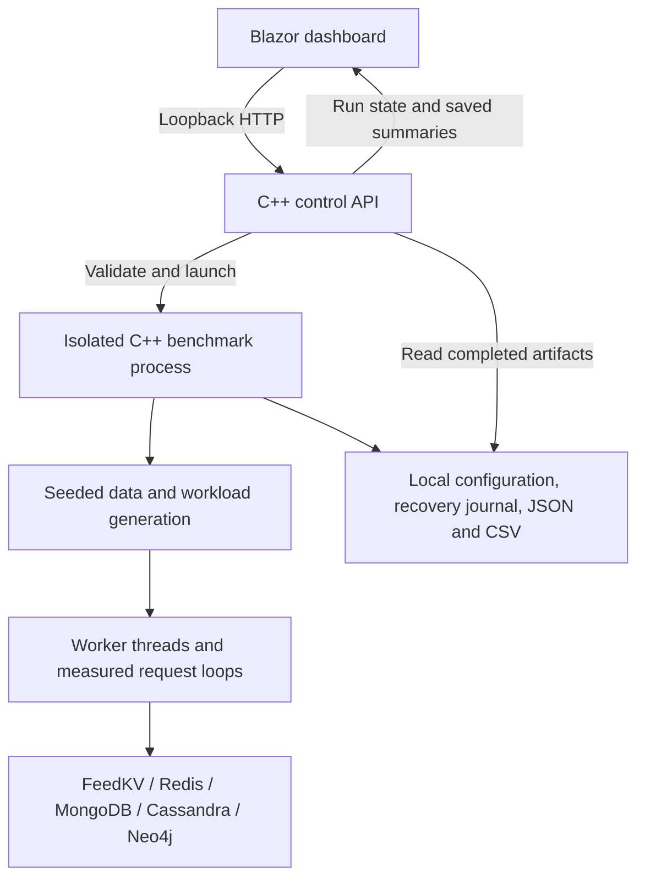

# BenchForge architecture

BenchForge is a local database benchmark platform with a C++20 load engine and control API, a C# Blazor WebAssembly dashboard, and five independent database targets: FeedKV, Redis, MongoDB, Cassandra and Neo4j. It uses a seeded synthetic feed workload to measure database operation paths and compare recorded conditions.

The implemented platform has passed native correctness checks for all five targets, nine default CTest checks and dashboard comparison checks. The committed local experiment contains 60 valid captures across 20 configurations, with three repetitions each. [The benchmark report](docs/BENCHMARK_RESULTS_2026-10-06.md) records measurements and their limits.

## Components and data flow



The API and UI run outside the timed database request path. Each benchmark uses a separate child process with its own worker threads. File serialization and dashboard analysis operate on completed artifacts. Results are local files, with no additional database required for the archive.

## Workload

| Operation | Default weight | Semantics |
| --- | ---: | --- |
| Timeline read | 40% | Newest 20 posts from followed authors |
| User profile read | 25% | Profile lookup by user ID |
| Post like | 15% | Idempotent like and represented count |
| Post create | 10% | New post with author/tag indexing and timeline visibility |
| Hashtag search | 5% | Newest posts for a tag |
| User follow | 5% | Idempotent directed relationship |

Weights, seed, dataset sizes, worker count, warm-up, duration and offered rate are configurable. Normal loading uses a regular directed-follow layout. Celebrity loading concentrates followers on user 0; measured post creation can also be biased toward that account. Top20 results use descending timestamp and numeric post ID ordering. Records are synthetic and isolated by run identity.

The adapters preserve high-level workload semantics while using native storage models. Consistency and transaction boundaries differ, so cross-database timings describe the implemented workload paths rather than a pure engine comparison.

## Load and measurement

- **Closed loop:** each worker starts its next operation after its previous request completes. Faster targets complete more operations and grow the dataset further.
- **Open loop:** one aggregate offered rate is shared across workers. The scheduler rechecks early wakeups, records send lag separately and finishes requests scheduled within the requested window.
- **Warm-up:** alternating read-only timeline/profile operations. The seeded generator resets before measurement, keeping the initial dataset and measured random stream independent of warm-up speed.
- **Throughput:** completed operations divided by actual elapsed wall time, including in-flight work and backlog drain. `config.duration_ms` remains the requested window; `measured_ms` records elapsed time.
- **Latency:** per-operation service time, classified by operation type. Bounded logarithmic histograms use 16 subdivisions per power of two and report approximate p50/p95/p99/p99.9 upper bucket bounds. Send lag is not added to service latency.
- **Calibration:** `noop` measures harness overhead; database-specific probes record transport/server round trips. Calibration is never subtracted from operation latency.

Errors, timeouts, dropped telemetry, cleanup failures, missing measured operations and invariant failures invalidate a capture. Startup connection failures also preserve an invalid summary and their cause, without inventing measurements or namespace ownership.

## Database adapters

| Target | Protocol and model | Ownership and cleanup |
| --- | --- | --- |
| FeedKV / Redis | Shared RESP2 client; profiles/posts, bidirectional follow sets, like sets, ordered author/tag indexes and materialized timelines | Atomic owner marker; exact `benchforge:<run-id>:` key prefix |
| MongoDB | OP_MSG/BSON; native compound/multikey indexes, document updates and read-time timeline aggregation | Dedicated database and marker collection; refuses existing data |
| Cassandra | CQL v4 prepared statements; query-specific partitions, logged post batch and read-time timeline merge | Unique keyspace; refuses an existing keyspace |
| Neo4j | HTTP Query API v2; parameterized Cypher, composite `(run,id)` indexes and native relationships | Run marker and owned graph; shared schema constraints retained |

FeedKV is a standalone volatile C++ database with one process-wide store. Its RESP command subset includes `PING`, `INFO`, `SET`, `SETNX`, `GET`, `SADD`, `SISMEMBER`, `SCARD`, `SMEMBERS`, `ZADD`, `ZSCORE`, `ZREVRANGE`, `ZREMRANGEBYRANK`, `SCAN` and `DEL`. The RESP client and accepted FeedKV sockets use TCP_NODELAY. A follow backfills the newest posts from its new author; post creation updates follower timelines.

Redis remains an independent reference implementation. The controlled experiment disables Redis RDB/AOF persistence to match FeedKV's volatile storage. MongoDB, Cassandra and Neo4j retain their recorded native durability. Query/index, persistence and adapter-version metadata accompany captures. [ADAPTERS.md](docs/ADAPTERS.md) describes setup, models and protocol limits.

## Local control API

The default listener is `127.0.0.1:8080`. The API validates bounded configuration fields and launches only the BenchForge worker executable with fixed argument structure. Request input is never passed through a shell. It permits one active benchmark per API session.

| Route | Purpose |
| --- | --- |
| `GET /health` | API health |
| `GET /api/adapters` | Available targets |
| `GET /api/runs` | Current session run ledger |
| `POST /api/runs` | Create a run from URL-encoded configuration fields |
| `GET /api/runs/{id}` | Run status |
| `POST /api/runs/{id}/cancel` | Request cooperative cancellation |
| `GET /api/runs/{id}/results` | Read a completed diagnostic or valid summary |
| `GET /api/results` | Persisted capture catalog |
| `GET /api/results/{bucket}~{run-id}` | Read an archived capture |

The Host header must be local; CORS permits the local dashboard origin. Dataset sizes, worker counts, rates, durations and request sizes are bounded. Database endpoints are restricted to localhost/loopback. Authentication, TLS, remote deployment and distributed orchestration are outside the implemented local scope.

## Run lifecycle and recovery

Workers write `recovery.json` before loading. After namespace acquisition, a callback atomically records ownership. Loading batches, measured loops and scheduled waits check for cancellation. The owning loader finishes cleanup through a fresh connection where needed, clears ownership after success and saves an invalid diagnostic summary when cancelled.

The API gives cancellation 30 seconds before forced termination. A hard stop may leave synthetic data behind. `benchforge recover --manifest PATH/recovery.json` refuses a live recorded PID, validates local endpoint/run identity and removes only the recorded namespace. Repeated successful recovery is harmless. Owner markers remain until cleanup completes so partially interrupted cleanup can be retried.

A crash between namespace acquisition and journal commit can require manual inspection. Recovery is intentionally limited to known, owned synthetic namespaces; it does not use wildcard database/keyspace deletion. Run IDs with existing artifacts are refused.

```text
runs/<run-id>/                  CLI captures
runs/api/<run-id>/              Dashboard captures
  worker.conf                  API-generated configuration
  recovery.json                Ownership and lifecycle journal
  summary.json                 Measurements, metadata and invalid reasons
  operations.csv               Per-operation measurements
runs/experiments/<run-id>/      Analysis copies of experiment captures
runs/verification/<run-id>/     Readiness and correctness probes
evidence/benchmarks/<id>/       Committed experiment evidence
```

## Dashboard and archive

The configuration screen exposes workload weights, adapter, scenario, seed, dataset size and load controls. Its run ledger shows API-backed state and offers cancellation for active workers. Completed and failed runs show summaries, environment, calibration and cleanup; unmeasured latency channels show a dash.

Analysis reads the persisted archive independently of session history. Baseline/candidate selections survive reload in URL parameters, stale requests are cancelled, and API offline/recovery states are visible. Percentage changes require valid captures with matching workload, host, resource and measurement conditions. Invalid, unfinished, `noop` and verification captures retain diagnostic values while withholding changes.

Repetition groups require at least three matching valid captures and show accepted counts, per-run medians and minimum–maximum ranges. Invalid, duplicate and mismatched evidence is excluded with reasons. Percentile samples are never pooled; each group is capped at 30 captures.

Archive scans reject unsafe paths, symlinks, mismatched IDs and malformed/unsupported summaries. Each summary is limited to 1 MiB; catalog scans stop at 5,000 entries or 32 MiB of source data and return at most 500 captures. Skipped/truncated counts are visible.

## Experiment procedure and interpretation

The standard-library Python driver starts one pinned-image database container at a time, applies 2 CPU/2 GiB caps without additional swap, checks readiness/native integration tests and collects three or more repetitions across normal/celebrity and closed/open-loop profiles. Every repetition gets a fresh worker and namespace; the database process remains warm. Ports are published only on loopback. Only the driver's containers and anonymous volumes are removed on exit.

Each experiment records source/binary/image provenance, configurations, raw summaries and CSV, resource observations, server/available GC logs and regenerated median/range aggregates. Resource samples cover loading and measurement together; GC pauses and competing host activity are not isolated. Hash verification checks exact captured bytes across Windows and Linux clones.

The completed laptop-scale experiment establishes that these workload paths execute and can be measured reproducibly under recorded conditions. Three short repetitions, small datasets, fixed ordering and different models/durability do not establish a universal ranking. FeedKV and Redis throughput ranges overlap and the direction changes by scenario. Further scaling or distributed experiments require new profiles and evidence.
