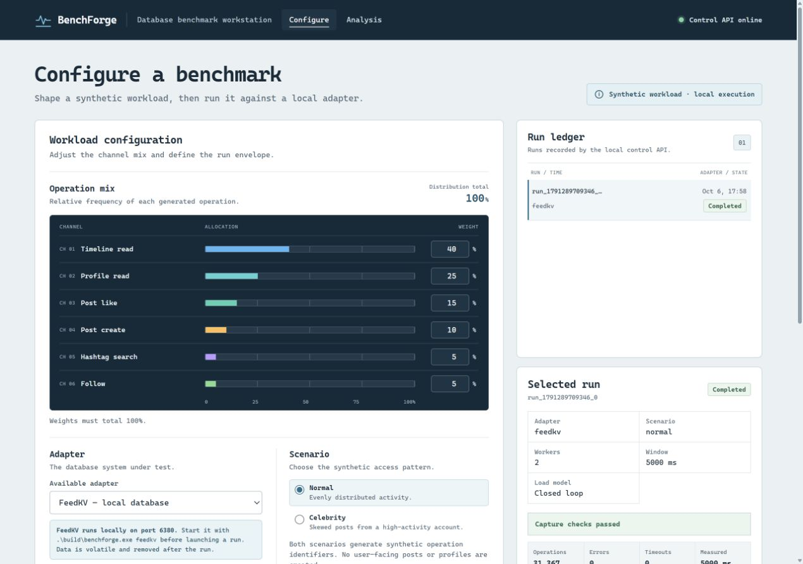
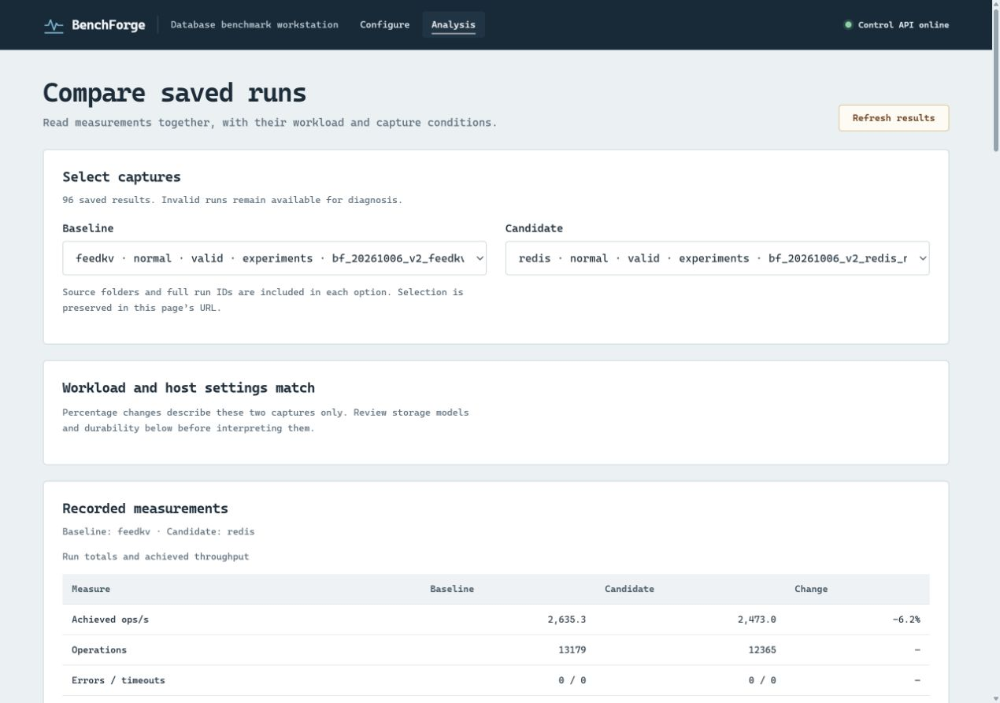
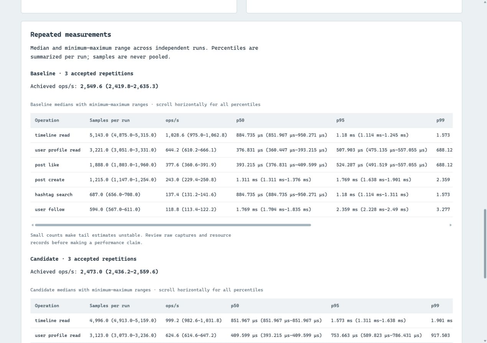

# BenchForge

**A local database benchmark platform built with C++20 and C# Blazor.**

BenchForge runs a seeded synthetic feed workload against **FeedKV, Redis, MongoDB, Cassandra and Neo4j**. It combines an isolated C++ load engine, a local control API, a purpose-built in-memory database and a dashboard for configuring runs and comparing saved measurements.

[Quick start](#quick-start) · [Measured results](#measured-results) · [Architecture](ARCHITECTURE.md) · [Adapter guide](docs/ADAPTERS.md) · [Full benchmark report](docs/BENCHMARK_RESULTS_2026-10-06.md)



## What it does

- **Runs six database operations:** timeline reads, profile reads, likes, post creation, hashtag searches and follows, with configurable weights, dataset sizes and normal/celebrity scenarios.
- **Controls load:** closed-loop concurrency or a shared open-loop request rate, read-only warm-up, seeded generation and actual elapsed-time throughput.
- **Records evidence:** per-operation p50/p95/p99/p99.9, errors, timeouts, scheduling lag, calibration, host details, database versions, storage settings and JSON/CSV artifacts.
- **Compares saved runs:** matching-condition checks, visible exclusions, and medians with minimum–maximum ranges across at least three valid repetitions. Percentile samples are never pooled.
- **Handles interrupted runs:** cooperative cancellation, owned-namespace cleanup, retained failure diagnostics and journal-based crash recovery.

The workload uses synthetic profiles, posts and relationships. Each database is an independent target. The platform, dashboard and result archive run locally.

## Measured results

The committed experiment contains **60 valid captures across 20 configurations**, with **three repetitions each**. All captures completed with **zero measured errors, timeouts or dropped telemetry**, and successful namespace cleanup. Native integration checks passed for all five targets; the default CTest suite passed all nine checks, and the dashboard build completed with zero warnings or errors.

Each database ran alone in a Linux Docker container capped at **2 CPUs and 2 GiB memory**, with a Windows Release worker, two client threads, seed 42, 64 users, 256 initial posts, 128 follows and eight hashtags. Runs used a one-second warm-up and five-second requested measurement window.

**Closed-loop throughput — median ops/s (minimum–maximum), three runs per cell:**

| Database | Normal workload | Celebrity workload |
| :--- | ---: | ---: |
| FeedKV 0.2 | 2,549.6 (2,419.8–2,635.3) | 2,132.4 (1,956.4–2,327.1) |
| Redis 7.4.11 | 2,473.0 (2,436.2–2,559.6) | 2,232.2 (1,959.6–2,322.2) |
| MongoDB 8.0.32 | 2,085.6 (1,897.6–2,181.6) | 2,005.4 (1,744.8–2,127.8) |
| Cassandra 4.1.12 | 207.5 (167.3–208.7) | 321.8 (275.7–321.9) |
| Neo4j 5.26.31 | 325.3 (252.6–386.1) | 603.5 (471.7–678.3) |

All 30 open-loop captures completed their 500 requests at an offered rate of 100 ops/s. That offered load is not a maximum-capacity measurement.

FeedKV and Redis throughput ranges overlap, and the lead changes by scenario. These are small, single-host workload results. Native models, protocols and durability differ across databases; fixed run order, warm server state and host activity also affect interpretation. The [full report](docs/BENCHMARK_RESULTS_2026-10-06.md) includes operation latency, provenance and limitations; [raw evidence](evidence/benchmarks/bf_20261006_v2/) includes every capture, resource observations and verification output.

<details>
<summary><strong>See the saved-run analysis and repetition views</strong></summary>

Compare two captures with their workload, validity and host conditions visible:



Inspect accepted repetitions, per-run medians and minimum–maximum ranges:



The Analysis screenshots show captures from the committed experiment. The configuration screenshot shows a separate local FeedKV demonstration run. All screenshots come from the running application.

</details>

## Quick start

The commands below use Windows PowerShell, the environment used for the recorded experiment.

**Requirements:** CMake and a C++20 compiler (tested with MinGW), the .NET 9 SDK, and Python 3 for regression checks and experiment scripts. Docker Desktop with Linux containers is required for the automated five-database suite. Python scripts use the standard library.

### 1. Build

```powershell
git clone https://github.com/Pikachu-5/nosql-bench.git
cd nosql-bench
cmake -S . -B build -G "MinGW Makefiles" -DCMAKE_BUILD_TYPE=Release
cmake --build build --parallel
dotnet restore ui\BenchForge.UI.csproj
```

### 2. Open the committed results

No running database is needed to inspect saved captures:

```powershell
python scripts/verify_evidence.py evidence/benchmarks/bf_20261006_v2
python scripts/import_experiment.py evidence/benchmarks/bf_20261006_v2
```

Start the control API and dashboard in **separate terminals**, both from the repository root:

```powershell
.\build\benchforge.exe serve
```

```powershell
dotnet run --project ui\BenchForge.UI.csproj --launch-profile http
```

Open [localhost:5180/analysis](http://localhost:5180/analysis) and select matching `bf_20261006_v2` captures. The API listens on `127.0.0.1:8080`. Import accepts identical existing files and refuses conflicting captures; saved results remain available after API restarts.

### 3. Run FeedKV

Start its volatile in-memory server in another terminal:

```powershell
.\build\benchforge.exe feedkv
```

Choose **FeedKV** in the dashboard, or run the supplied small CLI profile:

```powershell
.\build\benchforge.exe validate --config config\feedkv-smoke.conf
.\build\benchforge.exe run --config config\feedkv-smoke.conf
```

The default FeedKV port is `6380`. Run files appear under `runs/<run-id>/`; dashboard runs use `runs/api/<run-id>/`. `config/default.conf` selects `noop`, which measures harness overhead without accessing a database.

## Database targets

| Target | Client path | Workload model | Default port |
| :--- | :--- | :--- | ---: |
| **FeedKV** | RESP2 subset | Volatile C++ store with materialized feed/tag indexes | 6380 |
| **Redis** | Same RESP client | Native keys, sets and sorted sets; materialized feeds | 6379 |
| **MongoDB** | Native OP_MSG/BSON | Indexed documents and read-time timeline aggregation | 27017 |
| **Cassandra** | Native CQL v4 | Prepared queries, query-specific partitions and timeline merging | 9042 |
| **Neo4j** | HTTP Query API v2 | Indexed graph nodes and native relationships | 7474 |

Connections are local-only. MongoDB, Cassandra and Neo4j use unauthenticated local test servers. Each adapter loads synthetic data into its own namespace and cleans only data owned by that run. FeedKV implements the RESP commands needed by this workload and has no persistence. See the [adapter guide](docs/ADAPTERS.md) for versions, setup, schema, durability and integration checks.

## Reproduce the experiment

With the Release build ready and Docker Desktop running:

```powershell
docker build -f Dockerfile.benchmark -t benchforge-feedkv:local .
python scripts/benchmark_suite.py --experiment benchmark_local_001 --repetitions 3 --duration-ms 5000 --rate 100
python scripts/verify_evidence.py evidence/benchmarks/benchmark_local_001
```

Use a fresh experiment ID each time. The suite pins official server image digests, checks readiness and native integrations, then runs the four scenario/load combinations on one database container at a time. It uses 2 CPU/2 GiB caps with no additional swap and publishes ports only on loopback. It refuses occupied ports and removes its own containers and anonymous volumes on exit. Failed evidence is retained and marked unfinished.

Raw JSON/CSV, configurations, image/build provenance, resource observations, server/available GC logs and aggregates are saved under `evidence/benchmarks/<experiment>/`. Analysis copies live under `runs/experiments/`. Resource observations cover the full worker lifetime, including loading; GC pauses are not isolated.

## Verification and recovery

```powershell
ctest --test-dir build --output-on-failure
dotnet run --project tests\ComparisonChecks
```

Default CTest covers archive boundaries, parsers, HTTP framing, cancellation/recovery, API failure diagnostics, aggregation, elapsed-time accounting and open-loop send lag. It starts bounded FeedKV fixtures and needs no external database. Live native checks are documented in the [adapter guide](docs/ADAPTERS.md).

Cancellation lets the worker finish its current operation, clean its owned namespace and save an invalid diagnostic capture. The API allows 30 seconds before forced termination. After a crash, inspect the run journal and recover that exact namespace:

```powershell
.\build\benchforge.exe recover --manifest runs/api/<run-id>/recovery.json
```

Recovery refuses a live recorded worker and validates the endpoint and run identity. Successful recovery is idempotent. A crash between namespace acquisition and journal commit can still require manual inspection. Details are in [ARCHITECTURE.md](ARCHITECTURE.md).

## Project layout

| Path | Contents |
| :--- | :--- |
| `src/`, `include/benchforge/` | C++ load engine, protocols, adapters, API and FeedKV server |
| `ui/` | Blazor configuration, run status and saved-result analysis |
| `config/` | Harness and database smoke profiles |
| `scripts/` | Container experiment driver, evidence verifier and importer |
| `tests/` | Native correctness checks and measurement regressions |
| `evidence/benchmarks/` | Committed experiment artifacts and provenance |
| `docs/` | Adapter guide, measured results, verification history and screenshots |

Vendored [nlohmann/json 3.12.0](include/nlohmann/) is covered by its bundled [MIT license](include/nlohmann/LICENSE.MIT).
